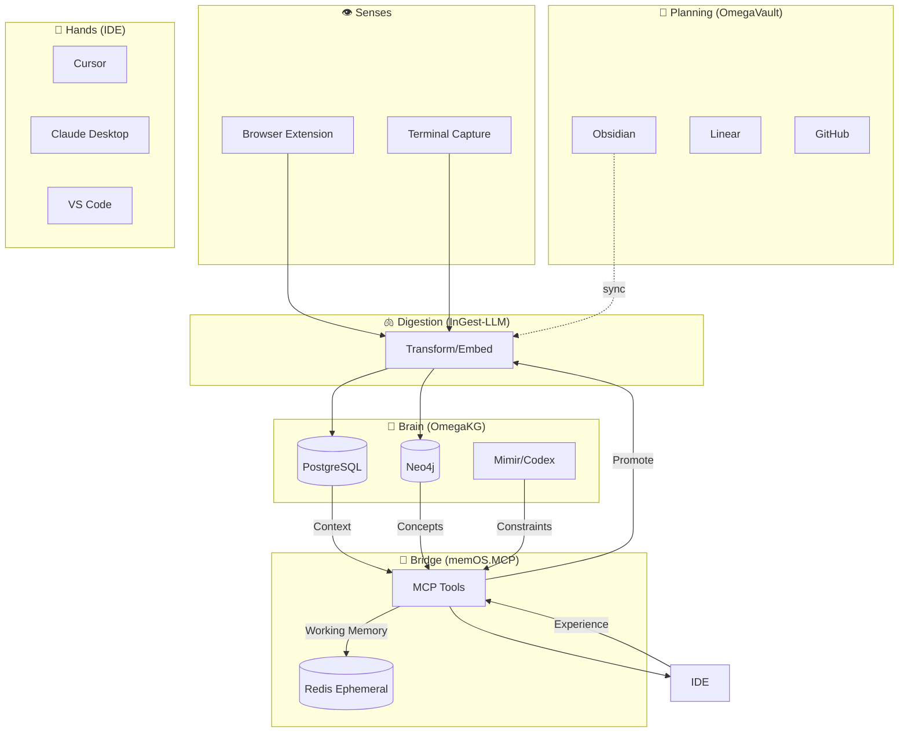

# memOS.MCP Architecture

memOS.MCP acts as the **conceptual bridge** (nerve pathways) between the **Brain** (OmegaKG) and the **Hands** (IDE).

## The Organism Model



## Core Components

### 1. Context Tools (Query Layer)
Tools that retrieve processed knowledge from the brain.

- **`retrieve_context`**: Semantic search via PGVector
- **`get_concepts`**: Graph traversal via Neo4j
- **`get_constraints`**: Rule enforcement via Mimir

### 2. Memory Tools (Working Layer)
Ephemeral storage for the current session context and reasoning.

- **`scratch_write/read`**: Agent reasoning traces
- **`set/get_working_memory`**: Session-scoped context
- **Stored in Redis**: Fast, ephemeral, TTL-based

### 3. Learning Tools (Feedback Layer)
Mechanism for hands to teach the brain.

- **`store_experience`**: Record working session data
- **`mark_significant`**: Flag high-value insights
- **`promote_memory`**: Send to InGest-LLM for permanent storage

## Data Flow

### Query Path
1. IDE requests context for "auth implementation"
2. memOS.MCP queries PGVector (semantic) + Neo4j (structural)
3. Returns optimized **Context Package**
   ```json
   {
     "context": [...],
     "constraints": ["Do not use JWT in params"],
     "tokens": 450
   }
   ```

### Learning Path
1. Agent completes complex refactor
2. Agent calls `mark_significant` with summary
3. Memory stored in Redis `pending` list
4. InGest-LLM digestor picks up memory
5. Memory embedded and stored in PostgreSQL/Neo4j
